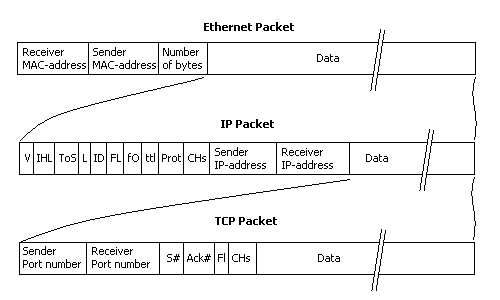
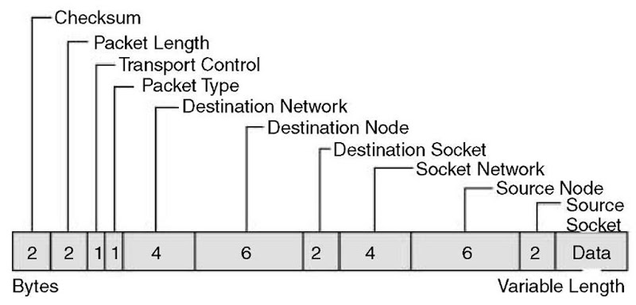
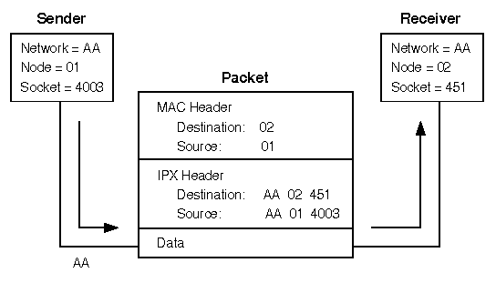

# BEW-1-2_research-kickoff
This repository is all about doing preliminary research on the following topics:

#### Packets and Protocols
- What’s a packet? What’s in it?
- How do TCP and UDP work?
- What are the major differences?
- What is each protocol used for?

#### Networks and Routers
- How many IP addresses are there (IPv4)?
- How does DHCP assign IP addresses?
- What does NAT do for a LAN?
- How are are packets routed?

#### Web Server Architecture
- Load balgiancing (high availability)
- Database replication (master/slave)
- Service-oriented architecture (if time)

#### Web Security Issues
- How does a firewall work?
- What is a DDoS attack?
- How does HTTPS/SSL/TLS work?
- What is SQL injection? (if time)

## Packets and Protocols
### What’s a packet? What’s in it?

### How do TCP and UDP work?

### What are the major differences?

### What is each protocol used for?

